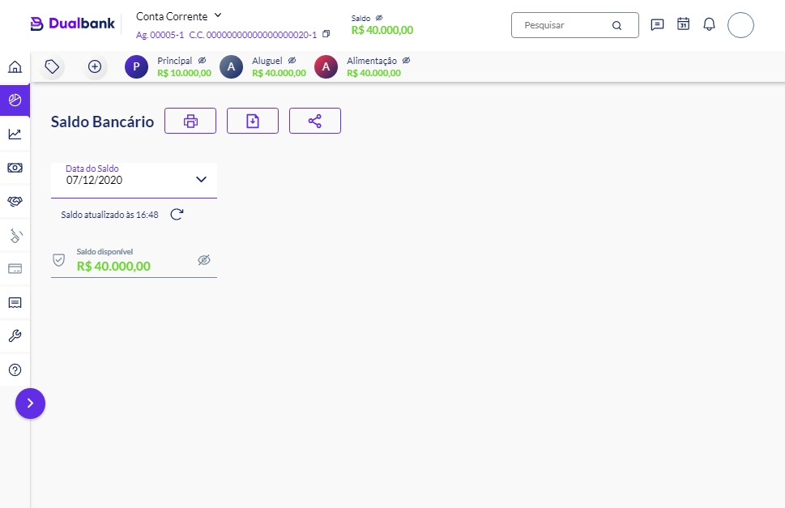

<div align="center" id="top"> 
  
</div>

<hr/>
<br>

## About

This applications is an personal finance manager. Check it out the [deploy](https://bank-dashboard.vercel.app)

## Screenshots

<div align="center" id="top"> 
  
</div>
<br/>

## Technologies

The following tools were used in this project:

- [React](https://pt-br.reactjs.org/)
- [TypeScript](https://www.typescriptlang.org/)
- [Next](https://nextjs.org)
- [React Icons](https://react-icons.github.io/react-icons/)
- [Styled Componensts](https://styled-components.com/)

## Requirements

Before starting 🏁, you need to have [Git](https://git-scm.com), [Node](https://nodejs.org/en/) and [Yarn](https://yarnpkg.com) installed.

## Starting

```bash
# Clone this project
$ git clone git@github.com:Thiago-spart/bank-dashboard.git

# Access
$ cd bank-dashboard

# Install dependencies
$ yarn

# Run the development project version
$ yarn dev

# The server will initialize in the <http://localhost:3000>
```

<hr>

<div style="align-items:center; justify-content:center; display:flex;">
	<p>
		Made with ❤️ and ☕ by <a href="https://github.com/Thiago-spart">Thiago</a>
	<p>
</div>

<hr>
&#xa0;

<a href="#top">Back to top</a>
